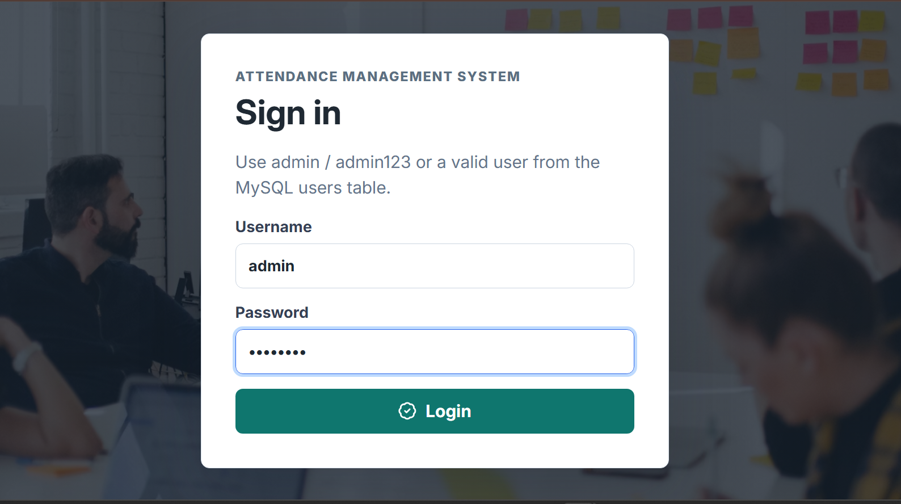
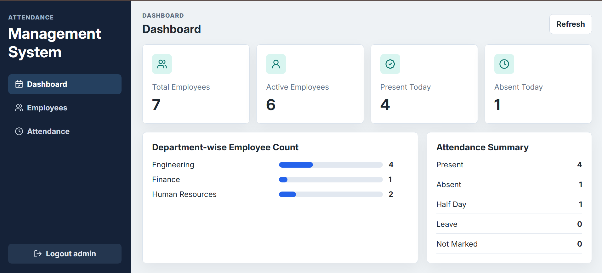
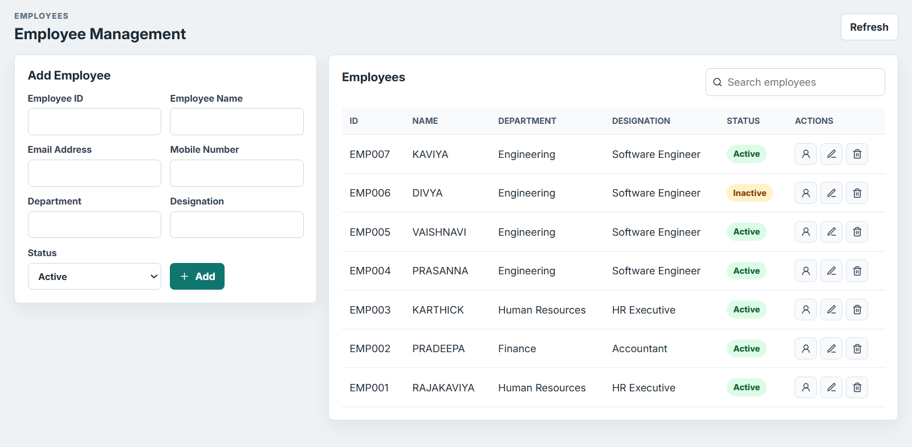
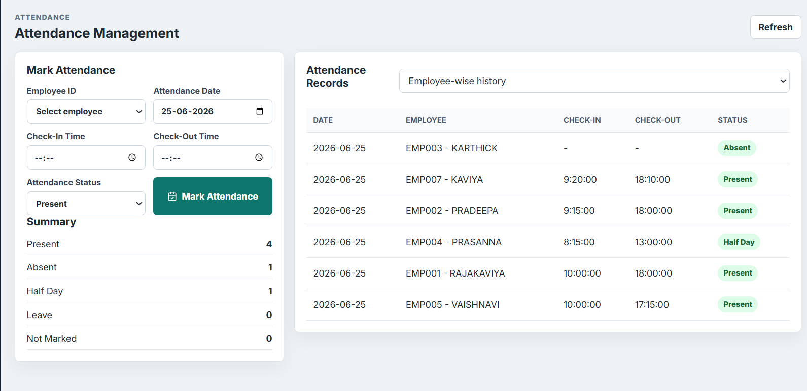

# Attendance Management System

A Full Stack Attendance Management System developed using **React.js**, **Flask**, and **MySQL**. The application enables administrators to manage employees, record attendance, monitor attendance history, and view dashboard analytics.

---

## 🚀 Features

### Authentication
- Secure Login System
- JWT Token-Based Authentication
- Protected API Endpoints

### Employee Management
- Add Employee
- Edit Employee
- Delete Employee
- View Employee Details
- Search Employees
- Active / Inactive Status Management

### Attendance Management
- Mark Attendance
- Present, Absent, Half Day, and Leave Status
- Attendance History
- Employee-wise Attendance Tracking
- Daily Attendance Summary

### Dashboard
- Total Employees Count
- Active Employees Count
- Present Employees Today
- Absent Employees Today
- Department-wise Employee Statistics

### Database Features
- Normalized MySQL Database Design
- Primary Keys and Foreign Keys
- Constraints and Validation
- Audit Fields (Created By, Updated By)

---

## 🛠 Technology Stack

| Layer | Technology |
|---------|------------|
| Frontend | React.js |
| Backend | Flask (Python) |
| Database | MySQL |
| Authentication | JWT |
| API Testing | Postman |
| Version Control | Git & GitHub |

---

## 📂 Project Structure

```text
Attendance Management System/
│
├── backend/
│   ├── app.py
│   ├── config.py
│   ├── db.py
│   ├── requirements.txt
│   └── .env.example
│
├── frontend/
│   ├── package.json
│   ├── index.html
│   └── src/
│
├── database/
│   └── schema.sql
│
├── Screenshots/
│   ├── 1.Login.png
│   ├── 2.Dashboard.png
│   ├── 3.Employees.png
│   └── 4.Attendance.png
│
└── README.md
```

---

## 🗄 Database Setup

Create the database and tables:

```bash
mysql -u root -p < database/schema.sql
```

Update the database credentials in:

```text
backend/.env
```

using:

```text
backend/.env.example
```

---

## ⚙ Backend Setup

```bash
cd backend

python -m venv .venv

.venv\Scripts\activate

pip install -r requirements.txt

python app.py
```

Backend URL:

```text
http://localhost:5000
```

### Default Login Credentials

```text
Username : admin
Password : admin123
```

---

## 💻 Frontend Setup

```bash
cd frontend

npm install

npm run dev
```

Frontend URL:

```text
http://localhost:5173
```

---

## 🔗 API Endpoints

### Authentication

```http
POST /api/auth/login
```

### Employee APIs

```http
POST   /api/employees
GET    /api/employees
GET    /api/employees/<id>
PUT    /api/employees/<id>
DELETE /api/employees/<id>
```

### Attendance APIs

```http
POST /api/attendance
GET  /api/attendance
GET  /api/attendance/summary
GET  /api/attendance/employee/<employee_id>
```

### Dashboard API

```http
GET /api/dashboard
```

---

## 📸 Screenshots

### Login Page



### Dashboard



### Employee Management



### Attendance Management



---

## 👨‍💻 Author

**Rajakaviya S**


---


